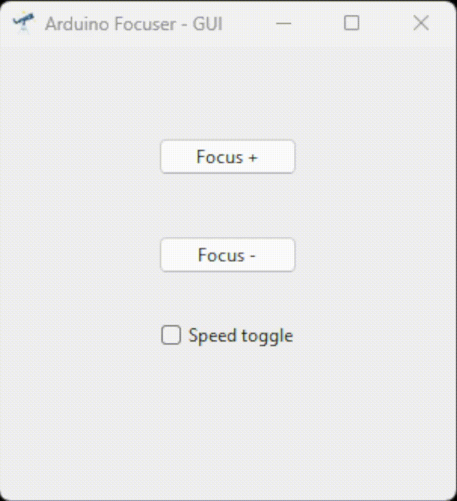

# Arduino Focuser Project

Autofocuser is an open-source project aimed at providing a solution for automatically controlling the focus wheel on a telescope. By utilizing an Arduino and a servo motor, users can interact with a Python-based GUI to adjust the focus remotely. This project allows enthusiasts to build their own autofocus system for their telescopes.

    

## Table of Contents

- [Introduction](#introduction)
- [Components Used](#components-used)
- [How It Works](#how-it-works)
- [Setup Instructions](#setup-instructions)
- [Usage](#usage)
- [Contributing](#contributing)

## Introduction

In astrophotography, achieving precise focus is crucial for capturing clear and detailed images of celestial objects. The Autofocuser project aims to simplify this process by automating the adjustment of the telescope's focus wheel. By integrating an Arduino-controlled servo motor with a Python GUI, users can remotely control the focus without the need for manual adjustments.

## Components Used

The Autofocuser project utilizes the following components:

- Arduino Nano
- PWM controller for Sunfonder
- Injora continuous 360-degree servo motor
- 9V battery
- Micro USB cable
- GT2 belt and pulley
- 3D printed housing

    
    

## How It Works

The Autofocuser system consists of two main components: the hardware and the software.

### Hardware

The hardware setup includes mounting the servo motor onto the telescope's focuser and connecting it to the Arduino Nano. The Arduino Nano is powered by the PC and communicates with the Python GUI via a micro USB cable. The servo and PWM driver board are powered by a seperate 9V battery. The GT2 belt and pulley mechanism drive the focusing wheel on the telescope, allowing precise adjustments.

### Software

The software component consists of a Python-based GUI that communicates with the Arduino Nano over serial connection. The GUI provides users with buttons to control the direction and speed of the servo motor, allowing them to adjust the focus remotely. The PWM controller ensures smooth and accurate movement of the servo motor, enhancing the overall user experience.

  

## Setup Instructions

To set up the Autofocuser system, follow these steps:

1. Assemble the hardware components according to the provided instructions.
2. Install the Arduino sketch onto the Arduino Nano.
3. Connect the Arduino Nano to your computer using the micro USB cable.
4. Install the necessary Python dependencies for the GUI.
5. Run the Python GUI script to start controlling the Autofocuser.

## Usage

Once the Autofocuser system is set up, users can interact with the Python GUI to adjust the focus of their telescope. The GUI provides intuitive controls for turning the focus wheel in both directions and adjusting the speed of the motor. Users can customize the speed settings to suit their specific needs, allowing for precise and efficient focusing.

The GIF below shows real time usage with my telescope equiped with ASI 224MC USB camera and AutoFocuser GUI to set the focus on a random object.

    

## Contributing

Contributions to the Autofocuser project are welcome! If you have ideas for improvements or new features, feel free to open an issue or submit a pull request on GitHub.

